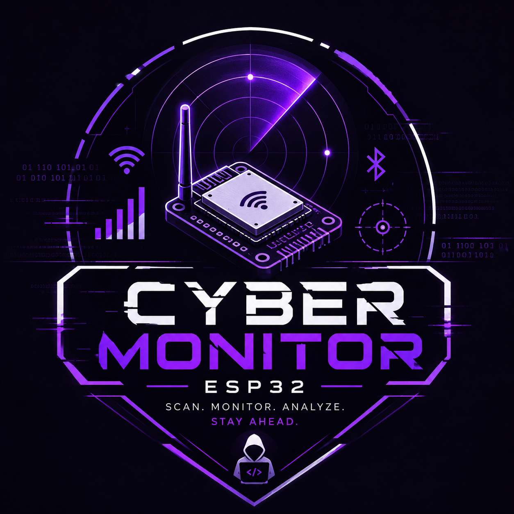

<p align="center">
  
</p>

# ESP32 Cyber Monitor — Firmware SDD

# Visão Geral

O firmware do ESP32 será responsável por:

* Escaneamento Wi‑Fi
* Escaneamento BLE
* Exposição de API REST
* Comunicação realtime via WebSocket
* Processamento local
* Logs e monitoramento
* Serial debug

---

# Objetivos do Firmware

## Principais responsabilidades

* Coletar dados de redes Wi‑Fi
* Coletar dispositivos BLE próximos
* Padronizar responses JSON
* Disponibilizar APIs HTTP
* Disponibilizar realtime via WebSocket
* Gerenciar ciclos de scan
* Fornecer métricas do dispositivo

---

# Stack

## Framework

* Arduino Framework

## IDE

* VSCode
* PlatformIO

---

# Bibliotecas

## Obrigatórias

```cpp
WiFi.h
ESPAsyncWebServer.h
AsyncTCP.h
ArduinoJson.h
BLEDevice.h
```

---

# Estrutura do Projeto

```txt
/firmware
 ├── include
 │
 ├── lib
 │
 ├── src
 │   ├── main.cpp
 │   ├── config.h
 │   ├── wifi_scanner.cpp
 │   ├── wifi_scanner.h
 │   ├── ble_scanner.cpp
 │   ├── ble_scanner.h
 │   ├── api_routes.cpp
 │   ├── api_routes.h
 │   ├── websocket.cpp
 │   ├── websocket.h
 │   ├── logger.cpp
 │   ├── logger.h
 │   │
 │   ├── models
 │   │   ├── wifi_network.h
 │   │   ├── ble_device.h
 │   │   └── stats.h
 │   │
 │   ├── services
 │   │   ├── wifi_service.cpp
 │   │   ├── ble_service.cpp
 │   │   └── stats_service.cpp
 │   │
 │   └── utils
 │       ├── json_helper.cpp
 │       └── json_helper.h
 │
 ├── platformio.ini
 └── README.md
```

---

# Configuração Base

## config.h

```cpp
#pragma once

#define WIFI_SSID "SEU_WIFI"
#define WIFI_PASSWORD "SUA_SENHA"

#define API_PORT 80
#define WS_ENDPOINT "/ws"

#define WIFI_SCAN_INTERVAL 10000
#define BLE_SCAN_INTERVAL 15000
```

---

# Modelos de Dados

# wifi_network.h

```cpp
struct WifiNetwork {
    String ssid;
    String bssid;
    int rssi;
    int channel;
    String encryption;
};
```

---

# ble_device.h

```cpp
struct BleDevice {
    String name;
    String mac;
    int rssi;
    String uuid;
};
```

---

# stats.h

```cpp
struct Stats {
    int wifiNetworks;
    int bleDevices;
    long uptime;
};
```

---

# API REST

# Base URL

```txt
http://ESP32_IP/api
```

---

# Endpoints

# GET /api/wifi

## Objetivo

Retorna redes Wi‑Fi detectadas.

## Response

```json
{
  "success": true,
  "timestamp": 1740000000,
  "count": 2,
  "data": [
    {
      "ssid": "NETGEAR",
      "bssid": "00:11:22:33:44:55",
      "rssi": -42,
      "channel": 6,
      "encryption": "WPA2"
    }
  ]
}
```

---

# GET /api/ble

## Response

```json
{
  "success": true,
  "timestamp": 1740000000,
  "count": 1,
  "data": [
    {
      "name": "Galaxy Buds",
      "mac": "11:22:33:44:55:66",
      "rssi": -61,
      "uuid": "180D"
    }
  ]
}
```

---

# GET /api/stats

## Response

```json
{
  "success": true,
  "data": {
    "wifiNetworks": 12,
    "bleDevices": 8,
    "uptime": 3600
  }
}
```

---

# WebSocket

# Endpoint

```txt
ws://ESP32_IP/ws
```

---

# Eventos

# WIFI_UPDATE

```json
{
  "event": "WIFI_UPDATE",
  "payload": {
    "ssid": "NETGEAR",
    "rssi": -40
  }
}
```

---

# BLE_UPDATE

```json
{
  "event": "BLE_UPDATE",
  "payload": {
    "name": "Smart Watch",
    "rssi": -58
  }
}
```

---

# Fluxo do Firmware

```txt
main.cpp
   ↓
Inicialização Wi‑Fi
   ↓
Inicialização API
   ↓
Inicialização WebSocket
   ↓
Loop de scan
   ↓
Transformação JSON
   ↓
Envio realtime
```

---

# main.cpp

## Responsabilidades

* iniciar serial
* conectar no Wi‑Fi
* iniciar API
* iniciar WebSocket
* iniciar scanners
* executar loop principal

---

# Serviços

# wifi_service.cpp

## Responsabilidades

* executar scans
* armazenar resultados
* atualizar cache
* preparar JSON

---

# ble_service.cpp

## Responsabilidades

* scan BLE
* identificar dispositivos
* armazenar cache
* montar payloads

---

# stats_service.cpp

## Responsabilidades

* uptime
* métricas gerais
* memória livre
* total dispositivos

---

# Logger

# logger.cpp

## Objetivo

Padronizar logs do firmware.

## Exemplo

```cpp
Logger::info("WiFi connected");
Logger::error("BLE failed");
```

---

# Padrão de Logs

```txt
[INFO] WiFi connected
[INFO] BLE scanner started
[ERROR] Failed to initialize BLE
```

---

# Padrões Arquiteturais

# Responsabilidades

## services/

Lógica de negócio.

## models/

Estruturas de dados.

## api_routes/

Rotas HTTP.

## websocket/

Realtime.

## utils/

Helpers.

---

# platformio.ini

```ini
[env:esp32dev]
platform = espressif32
board = esp32dev
framework = arduino
monitor_speed = 115200

lib_deps =
  me-no-dev/ESP Async WebServer
  bblanchon/ArduinoJson
```

---

# Convenções

# Arquivos

snake_case.

```txt
wifi_scanner.cpp
```

---

# Classes

PascalCase.

```cpp
class WifiService {}
```

---

# Funções

camelCase.

```cpp
scanWifiNetworks();
```

---

# Futuras Expansões

* OTA update
* MQTT
* OLED
* GPS
* SD card
* banco local
* heatmap
* alertas
